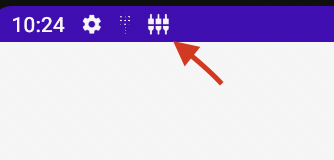

# Debug-panel

#### Бибилиотека для отладки приложений.

[Документация по разработке плагинов][plugin-development-doc]

### [v 0.6.9][last-release]
### [Changelog][changelog]

### [!]Важно. Библиотека находится в стадии разработки.

Тебе надоело каждый раз вручную вбивать логин и пароль тестового пользователя или пересобирать приложение для того чтобы поменять сервер в настройках? Эта библиотека разрабатывается с идеей решить эти и другие проблемы, и сделать процесс отладки приложения более удобным. 

В данный момент библиотека предоставляет следующий функционал:

1. **Добавление, редактирование и выбор юзера.**
2. **Добавление, редактирование и выбор сервера.**
3. **Просмотр и редактирование SharedPreferences.**
4. **Управление Feature toggle на основе Flipper.**

Библиотека разрабатывается используя подход работы с плагинами, когда каждый функционал подключается отдельным модулем в зависимостях.

## Подключение библиотеки

Для работы с библиотекой необходимо:

1. Подключить репозиторий в ваш `build.gradle`  файл

```groovy
maven {
    credentials {
        username 'nexus_user_name'
        password 'nexus_user_password'
    }
    url 'https://nexus.redmadrobot.com/repository/android/'
}
```


2. Подключить `Core` модуль для работы самой панели:

```groovy

dependencies {
    //core модуль панели
    implementation 'com.redmadrobot.debug:panel-core:${debug_panel_version}'
}
```


3. Подключить плагины для того функционала который вам нужен

```groovy
dependencies {
    //Плагин для работы с аккаунтами
    implementation 'com.redmadrobot.debug:accounts-plugin:${debug_panel_version}'
    
    //Плагин для работы с серверами
    implementation 'com.redmadrobot.debug:servers-plugin:${debug_panel_version}'
    
    //Плагин для работы с SharedPreferences
    implementation 'com.redmadrobot.debug:app-settings-plugin:${debug_panel_version}'

   //Плагин для работы с Feature Toggle на основе Flipper
   implementation 'com.redmadrobot.debug:flipper-plugin:${debug_panel_version}'
   //Так же необходимо подключить саму библеотеку flipper
   implementation "com.redmadrobot:flipper:${flipper_version}"
}

```


4. Для того чтобы библиотека не попала в релизную сборку необходимо подключить `no-op` версию библиотеки

```groovy
   releaseImplementation 'com.redmadrobot.debug:panel-no-op:${debug_panel_version}'
```


## Использование библиотеки в коде

Общий принцип подключения библиотеки в коде выглядит так:

```kotlin
class App : Application() {

    override fun onCreate() {
        super.onCreate()
        
      DebugPanel.initialize(
            application = this,
            plugins = listOf(
                AccountsPlugin(/*arguments*/),
                ServersPlugin(/*arguments*/),
                AppSettingsPlugin(/*arguments*/)
            )
        )
    }
}
```

Для того чтобы открыть DebugPanel, нужно вызвать в коде:

```kotlin
fun openDebugPanel() {
    DebugPanel.showPanel(supportFragmentManager)
}
```

Так же в панель можно войти через уведомление которое появляется при запуске приложения использующее библиотеку. Через это же уведомление можно перейти в ручную настройку панели. Для этого нужно нажать кнопку `SETTINGS` в раскрытом уведомлении.



## Конфигурация

Для дополнительной конфигурации **DebugPanel**, нужно добавить свою версию `DebugPanelConfig` класса при инициализации панели.

```kotlin
   DebugPanel.initialize(
            application = this,
            config = DebugPanelConfig(),
            plugins = listOf(/*plugins*/)
)
```

### Доступные возможности для конфигурации 

`shakerMode: Boolean` - Открытие **DebugPanel** при встряхивании устройства.

## Работа с плагинами

### AccountsPlugin 
Используется для работы тестовыми аккаунтами.

Можно задать список предустановленных аккаунтов

```kotlin
AccountsPlugin(
    preInstalledAccounts = listOf(
        DebugAccount(
            login = "user_login",
            password = "user_password",
            pin = "pin" //необязательное поле
        )
    )
)
```

Чтобы реагировать на смену пользователя вы можете подписаться на события `DebugPanel` внутри любого `LifecycleOwner` 

```kotlin
DebugPanel.subscribeToEvents(lifecycleOwner = this) { event ->
    when (event) {
        is AccountSelectedEvent -> {
            val account = event.debugAccount
          //Реализация перелогина
        }
    }
}
```

Так же вы можете использовать интерфейс `DebugAuthenticator` чтобы реализовать логику перелогина в отдельном классе который можно передать в плагин.

```kotlin
class UserAuthenticator : DebugAuthenticator {
    override fun onAccountSelected(account: DebugAccount) {
         //Реализация перелогина
    }
}
```

```kotlin
AccountsPlugin(
    preInstalledAccounts = listOf(),
    debugAuthenticator = UserAuthenticator()
)
```

Метод `onAccountSelected` будет вызываться при каждом выборе аккаунта

### ServersPlugin
Используется для работы с тестовыми серверами

Можно задать список предустановленных серверов

```kotlin
ServersPlugin(
    preInstalledServers = listOf(
        DebugServer(
            name = "server_name",
            url = "https://debug_server.com"
        )
    )
)
```

И подписаться на событие смены сервера	

```kotlin
DebugPanel.subscribeToEvents(lifecycleOwner = this) { event ->
    when (event) {
        is ServerSelectedEvent -> {
            val debugServer = event.debugServer
            // логика переключения сервера
        }
    }
}
```

Так же если вы используете `OkHttp` в своем сетевом стеке то можете использовать `DebugServerInterceptor` который будет автоматически подменять хост в запросах на выбранный вами.

```kotlin
OkHttpClient.Builder()
    .addInterceptor(DebugServerInterceptor())
    .build()
```

Если запросы должны еще как то модифицироваться, например добавляться Header'ы то это можно сделать используя метод `modifyRequest`

```kotlin
OkHttpClient.Builder()
   .addInterceptor(
       DebugServerInterceptor().modifyRequest { request, server ->
           if (server.name == "Test") {
               request.newBuilder()
                   .addHeader("Authorization", "testToken")
                   .build()
           } else {
               request
           }
       }
   )
   .build()
```
Текущий выбранный сервер можно получить следующим образом

```kotlin
val selectedServer = getPlugin<ServersPlugin>().getSelectedServer()
```


### AppSettingsPlugin 

Используется для просмотра и редактирования `SharedPreferences` в проекте

Для подключения плагина, необходимо передать в него список `SharedPreferences` с которыми хотите работать:

```kotlin
 AppSettingsPlugin(
     sharedPreferences = listOf(
         primarySharedPreferences,
         secondarySharedPreferences
     )
 )
```

### FlipperPlugin

Используется для просмотра и редактирования Flipper feature toggle'ов в проекте

Для подключения плагина, необходимо передать в него map поддерживаемых фичей и их значений

```kotlin
FlipperPlugin(
   featureStateMap = mapOf(
      Feature() to FlipperValue()
   )
)
```

Для изменения значений в рамках проекта необходимо подписаться на event'ы изменения значения feature toggle

```kotlin
DebugPanel
   .observeEvents()
   ?.onEach { event ->
      if (event is FeatureValueChangedEvent) {
         updateToggle(event.feature, event.value)
      }
   }
   ?.launchIn(lifecycleScope)
```


# Безопасность!
Для того чтобы тестовые данные не попали в релизные сборки рекомендуется не задавать их явно в Application классе, а использовать реализации DebugDataProvider, которые можно разнести по разным buildType. Для release версии следует сделать пустую реализацию.

**buildType**  `debug`

```kotlin
class DebugServersProvider : DebugDataProvider<List<DebugServer>> {
   
    override fun provideData(): List<DebugServer> {
        return listOf(
            DebugServer(name = "debug 1", url = "https://testserver1.com")
        )
    }
}
```
**buildType**  `release`

```kotlin
class DebugServersProvider : DebugDataProvider<List<DebugServer>> {

    override fun provideData(): List<DebugServer> {
        return emptyList()
    }
}
```
Добавление в плагин

```kotlin
ServersPlugin(
    preInstalledServers = DebugServersProvider()
)
```

## Backlog разработки

- [ ]  Управление Feature toggle
- [ ]  Добавить возможность подменять полный путь запроса при использовании Retrofit
- [ ]  Логирование
    - [ ]  Логирование запросов
    - [ ]  Логирование аналитики
    - [ ]  Логирование ошибок(под вопросом)
- [ ]  Изменение настроек(Необходим ресерч)
    - [ ]  Настройки proxy.
    - [ ]  включение/отключение режима show layout bounds.
    - [ ]  включение/отключение профилирования GPU
- [ ]  Создание Deep-link
- [ ]  Сброс окружения/настроек/токенов


[last-release]:https://git.redmadrobot.com/r.choryev/Debug-panel/-/releases/0.6.9
[plugin-development-doc]:docs/plugin_development.md
[changelog]: docs/changelog.md
