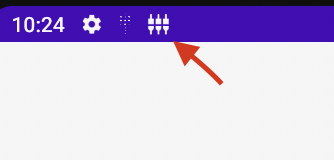

# Debug-panel

Библиотека для отладки приложений.


[](https://central.sonatype.com/search?namespace=com.redmadrobot.debug)
[][license]
[](#)

**[Changelog][changelog]** | **[Миграция на новые версии][migration-guide]**

Библиотека избавляет от необходимости пересобирать приложение для смены сервера или переключения feature toggle. Цель проекта — упростить процесс отладки приложения.

Основные возможности:

1. **Добавление, редактирование и выбор сервера.**
2. **Управление feature-toggles и remote config на основе Konfeature.**
3. **Отображение информации о приложении.**

Библиотека построена на подходе с использованием плагинов: каждая функциональность подключается отдельным модулем в зависимостях.

## Подключение библиотеки

Для работы с библиотекой необходимо выполнить следующие шаги:

1. Подключить `Core` модуль для работы самой панели:

```kotlin

dependencies {
    // Core модуль панели
   debugImplementation("com.redmadrobot.debug:panel-core:${debug_panel_version}")
}
```


2. Подключить необходимые плагины

```kotlin
dependencies {
    // Плагин для работы с серверами
    debugImplementation("com.redmadrobot.debug:plugin-servers:${debug_panel_version}")

    // Плагин для работы с remote config на основе Konfeature
    debugImplementation("com.redmadrobot.debug:plugin-konfeature:${debug_panel_version}")
    // Так же необходимо подключить саму библиотеку konfeature
    debugImplementation("com.redmadrobot.konfeature:konfeature:${konfeature_version}")

    // Плагин для отображения информации о приложении
    debugImplementation("com.redmadrobot.debug:plugin-about-app:${debug_panel_version}")
}

```

3. Для того, чтобы библиотека не попала в релизную сборку, необходимо подключить `no-op` версию библиотеки

```kotlin
   releaseImplementation("com.redmadrobot.debug:panel-no-op:${debug_panel_version}")
```

## Использование библиотеки в коде

Общий принцип подключения библиотеки в коде выглядит так:

```kotlin
class App : Application() {

    override fun onCreate() {
        super.onCreate()

        DebugPanel.initialize(
            application = this,
            plugins = listOf(
                ServersPlugin(/*arguments*/),
                KonfeaturePlugin(/*arguments*/),
                AboutAppPlugin(/*arguments*/),
            )
        )
    }
}
```

Для открытия DebugPanel необходимо вызвать:

```kotlin
fun openDebugPanel() {
    DebugPanel.showPanel(activity)
}
```

Также панель доступна через уведомление, которое появляется при запуске приложения, использующего библиотеку. Через это уведомление можно перейти к ручной настройке панели, нажав кнопку `SETTINGS` в раскрытом уведомлении.



## Работа с плагинами

### ServersPlugin
Используется для работы с тестовыми серверами

Доступна возможность задать список предустановленных серверов

```kotlin
ServersPlugin(
    preInstalledServers = listOf(
        DebugServer(
            name = "server_name",
            url = "https://debug_server.com",
            isDefault = true /*!!!Обязательно должен быть указан хотя бы один сервер по умолчанию*/
        )
    )
)
```

Подписка на событие смены сервера

```kotlin
DebugPanel.subscribeToEvents(lifecycleOwner = this) { event ->
    when (event) {
        is ServerSelectedEvent -> {
            val debugServer = event.debugServer
            // логика переключения сервера
        }
    }
}
```

Получение выбранного или сервера по умолчанию:

```kotlin
   val selectedServer = ServersPlugin.getSelectedServer()
   val defaultServer = ServersPlugin.getDefaultServer()
```

При использовании `OkHttp` в сетевом стеке можно применить `DebugServerInterceptor`, который автоматически подменяет хост в запросах на выбранный сервер.

```kotlin
OkHttpClient.Builder()
    .addInterceptor(DebugServerInterceptor())
    .build()
```

Если запросы требуют дополнительной модификации, например добавления заголовков, можно воспользоваться методом `modifyRequest`

```kotlin
OkHttpClient.Builder()
   .addInterceptor(
       DebugServerInterceptor().modifyRequest { request, server ->
           if (server.name == "Test") {
               request.newBuilder()
                   .addHeader("Authorization", "testToken")
                   .build()
           } else {
               request
           }
       }
   )
   .build()
```
Получение текущего выбранного сервера

```kotlin
val selectedServer = getPlugin<ServersPlugin>().getSelectedServer()
```


### Konfeature Plugin

В основе плагина лежит библиотека [Konfeature][konfeature], которая позволяет:

- отображать конфигурации feature, используемые в Konfeature
- просматривать источник каждого элемента конфигурации (Default, Firebase, AppGallery и др.)
- переопределять значения элементов конфигурации с типами Boolean, String, Long, Double

Для подключения плагина необходимо передать объект класса `KonfeatureDebugPanelInterceptor` и экземпляр `Konfeature`

```kotlin
val debugPanelInterceptor = KonfeatureDebugPanelInterceptor(context)

val konfeatureInstance = konfeature {
    if (isDebug) {
        addInterceptor(debugPanelInterceptor)
    }
}

KonfeaturePlugin(
    debugPanelInterceptor = debugPanelInterceptor,
    konfeature = konfeatureInstance,
)
```

В builder Konfeature доступны следующие настройки:

- добавление конфигурации конкретной фичи — `register(FeatureConfigN())`
- настройка работы с remote config через реализацию интерфейса `FeatureSource` — `addSource(featureSource)`
- настройка логирования — `setLogger(logger)`

### AboutApp Plugin

Предназначен для отображения информации о приложении: версии, номера сборки и других произвольных данных.

Для подключения плагина необходимо передать список объектов `AboutAppInfo`, содержащий хотя бы один элемент:

```kotlin
AboutAppPlugin(
    aboutAppInfo = listOf(
        AboutAppInfo(
            title = "Версия",
            value = BuildConfig.VERSION_NAME
        ),
        AboutAppInfo(
            title = "Номер билда",
            value = BuildConfig.VERSION_CODE.toString()
        )
    )
)
```

Каждый `AboutAppInfo` содержит:
- `title` — название поля (например, «Версия»)
- `value` — значение поля (например, «1.0.0»)

# Безопасность

Для предотвращения попадания тестовых данных в релизные сборки рекомендуется не задавать их явно в классе Application, а использовать реализации `DebugDataProvider`, которые можно разнести по разным `buildType`. Для release-версии следует создать пустую реализацию.

**buildType**  `debug`

```kotlin
class DebugServersProvider : DebugDataProvider<List<DebugServer>> {

    override fun provideData(): List<DebugServer> {
        return listOf(
            DebugServer(name = "debug 1", url = "https://testserver1.com")
        )
    }
}
```
**buildType**  `release`

```kotlin
class DebugServersProvider : DebugDataProvider<List<DebugServer>> {

    override fun provideData(): List<DebugServer> {
        return emptyList()
    }
}
```
Передача в плагин

```kotlin
ServersPlugin(
    preInstalledServers = DebugServersProvider()
)
```

[plugin-development-doc]:docs/plugin_development.md
[changelog]: ./CHANGELOG.md
[migration-guide]: docs/migration_guide.md
[konfeature]: https://github.com/RedMadRobot/Konfeature
[license]: LICENSE
